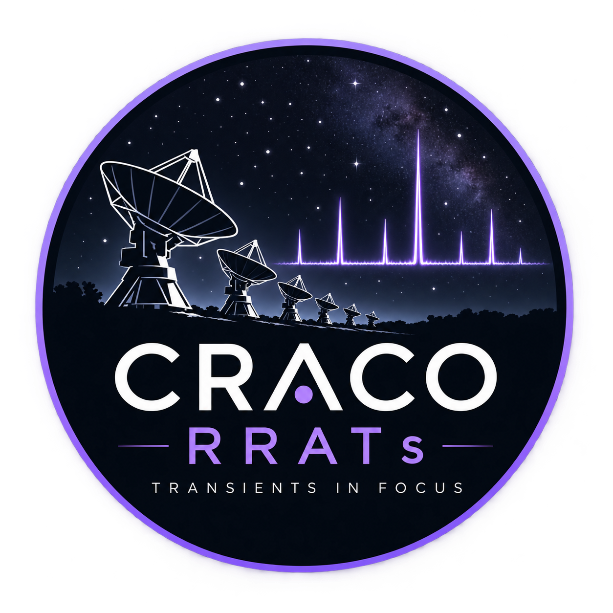

# CRACO RRATs Observatory

<div align="center">



### Coherent Real-Time Automatic Candidate Optimizer (CRACO)
**Australian Square Kilometre Array Pathfinder (ASKAP) Fast Transient Science & Parkes Follow-Up**

[](https://jainiakhil.github.io/CRACO-RRATs/)
[](https://vitejs.dev/)
[](https://reactjs.org/)
[](https://www.typescriptlang.org/)
[](https://tailwindcss.com/)
[](https://threejs.org/)
[](https://opensource.org/licenses/MIT)

</div>

---

## 🔭 Scientific Overview

Rotating Radio Transients (RRATs) represent a class of sporadically emitting, radio-quiet neutron stars characterised by infrequent, short (2–30 ms), and intense single radio bursts rather than continuous, strictly periodic pulse trains. Discovered in 2006 through reprocessing of archival data from the Parkes Multi-beam Pulsar Survey (PMPS; McLaughlin et al. 2006), their extreme intermittency—often displaying nulling fractions exceeding 99%—prevents discovery via standard Fourier-domain periodicity searches. Instead, detecting and understanding these objects requires high-time-resolution single-pulse discovery pipelines.

### The Zero-DM Selection Bias in Single-Dish Surveys
Traditional single-dish surveys (such as those conducted with the 64-m Murriyang / Parkes Radio Telescope and the Green Bank Telescope) operate by incoherently summing dish receiver feeds in the time domain. To suppress terrestrial Radio Frequency Interference (RFI), time-domain pipelines have historically relied on a destructive **zero-DM filter** that subtracts baseline channel averages. Because genuine celestial bursts with low Dispersion Measures ($\text{DM} \lesssim 15\text{--}20\text{ pc cm}^{-3}$) suffer virtually negligible dispersion delay across observing bands ($\Delta t \propto \text{DM} \cdot f^{-2}$), this subtraction filter inadvertently cancels out local Galactic RRATs, inducing an artificial discovery void at low DMs.

### The CRACO Image-Plane Breakthrough
The **Coherent Real-Time Automatic Candidate Optimizer (CRACO)** upgrade to the Australian Square Kilometre Array Pathfinder (**ASKAP**) overcomes this fundamental limitation:
1. **Direct Image-Plane Search**: CRACO cross-correlates visibilities across all 36 ASKAP antennas in real time, forming and de-dispersing millions of dirty synthesized images per second directly on custom FPGA/GPU architectures.
2. **Natural RFI Rejection**: Terrestrial interference arrives from the near field and lacks the geometric phase delays of celestial wavefronts, enabling robust spatial baseline discrimination without zero-DM cancellation.
3. **Sub-Arcsecond Astrometry**: Coherent imaging localises candidates to arcsecond and sub-arcsecond precision from the discovery pulse alone, bypassing the multi-year timing campaigns traditionally required for single-dish beam localisations.
4. **Targeted Follow-Up**: High-precision CRACO coordinates enable immediate, targeted timing and polarisation follow-up with the 64-m Murriyang / Parkes radio telescope using the Ultra-Wideband Low (UWL) receiver and the Medusa backend.

---

## 🌐 Web Platform Features

The **CRACO RRATs Observatory Web Platform** provides researchers and the astronomical community with an interactive, responsive telemetry environment:

### 1. Data Release Catalogue (`/#/data-release`)
- **Interactive Multi-Parameter Filtering**: Filter all 37 CRACO RRAT discoveries by Dispersion Measure, detection Signal-to-Noise Ratio (S/N), discovery epoch / scheduling block (SBID), and follow-up status.
- **Dual Visualisation Modes**: Toggle seamlessly between responsive telemetry cards and a high-density, sortable astronomical data table.
- **Inspection Modal**: Deep-dive popup dialog displaying J2000 astrometric coordinates with uncertainties, electron density distance estimates (NE2001, NE2025, and YMW16 models), spin period $P_0$, burst width $W_{50}$, PAF digital beam indices, observation metadata, and CASDA archive links.
- **Export Capabilities**: 1-click export of the active filtered catalogue in machine-readable **JSON** or **CSV** formats, plus local JSON candidate ingestion.

### 2. 3D Celestial Orbit View (`/#/visualisations`)
- **Real-Time Three.js WebGL Orbital Space**: Maps all CRACO RRATs in a three-dimensional celestial coordinate frame around Earth based on Right Ascension ($\alpha$), Declination ($\delta$), and electron-density model distances ($d_{\text{kpc}}$).
- **Celestial Reference Frame**: Visualises Galactic equator, celestial coordinate planes, equatorial grids, and distance range rings (5, 10, 15, and 20 kpc).
- **Interactive Telemetry**: Fully stationary by default; click and drag to rotate the coordinate sphere, scroll to zoom, and click any candidate point to inspect full discovery telemetry.
- **DM Colour Encoding**: Candidates are dynamically colour-coded across Dispersion Measure brackets: Low-DM ($<20\text{ pc cm}^{-3}$), Intermediate ($20\text{--}100$), High-DM ($>100$), and Extreme ($>900\text{ pc cm}^{-3}$, including J1743 and J1430).

### 3. 2D Parameter-Space Scatter Plotter (`/#/visualisations`)
- **Customisable Dual-Axis Telemetry**: Plot any combination of physical and observational parameters against each other (DM, spin period $P_0$, burst width $W_{50}$, detection S/N, burst rate, total detected pulses, NE2025 / NE2001 / YMW16 distances, RA, and Dec).
- **Logarithmic & Linear Scaling**: Independent log/linear scale switches for both X and Y axes.
- **Mouse Region Box Selection Zoom**: Click and drag a rectangular marquee across any cluster of data points on the SVG canvas to zoom directly into micro-regions. Screen coordinates are inverted into accurate physical data bounds with SVG clipping and high-precision sub-unit tick marks.
- **Reset Controls**: Instant zoom reset via the top toolbar button or by double-clicking the canvas.
- **Individual Candidate Selection**: Multi-select or isolate specific RRATs via quick chip toggles.

### 4. Dynamic Spectra Waterfall Spectrogram Viewer
- **Image-Plane Waterfall Plots**: Interactive canvas visualisation of frequency channels versus arrival time ($\Delta t \propto \text{DM} \cdot f^{-2}$).
- **Dedispersed vs. Dispersed Sweep**: Toggle between de-dispersed burst profiles and characteristic dispersed sweeps.
- **Scientific Colour Palettes**: Switch on-the-fly between Cosmic Violet, Viridis, Plasma, and Inferno colormaps.

### 5. Obsidian Telemetry Aesthetic
- **Cosmic Violet (`#9F80F8`) Palette**: Styled after the official mission patch emblem, accented with Laser Cyan (`#00f0ff`) and Neon Emerald (`#10b981`).
- **Reticle Telemetry Panels**: Technical corner crosshair borders (`.reticle-box`), Space Grotesk headings, and JetBrains Mono coordinate readouts.
- **Fully Opaque Modals**: Solid `#090b10` dialog backdrops eliminating distracting background bleed-through.

---

## 🛠️ Technology Stack

| Component | Technology | Purpose |
| :--- | :--- | :--- |
| **Framework** | [React 18](https://react.dev/) | Component architecture, state hooks, reactive UI |
| **Build Tool** | [Vite 6](https://vitejs.dev/) | Fast HMR, ESM bundling, and optimized static production compilation |
| **Type Safety** | [TypeScript 5](https://www.typescriptlang.org/) | Strict astronomical data types, schema validation, zero runtime errors |
| **Styling** | [Tailwind CSS 3](https://tailwindcss.com/) | Obsidian telemetry dark theme, responsive grid layouts, custom gradients |
| **3D Rendering** | [Three.js](https://threejs.org/) | Interactive WebGL celestial sphere coordinate projection |
| **Routing** | [React Router 6](https://reactrouter.com/) | Client-side routing with `HashRouter` for 100% reliable GitHub Pages hosting |
| **Icons** | [Lucide React](https://lucide.dev/) | Clean, lightweight telemetry and astronomical vector icons |

---

## 📁 Repository Structure

```
CRACO-RRATs/
├── .github/
│   └── workflows/
│       └── deploy.yml          # GitHub Actions automated deployment to GitHub Pages
├── public/
│   └── logo.png                # Static favicon & social graph assets
├── src/
│   ├── assets/
│   │   └── logo.png            # High-resolution official CRACO RRATs mission emblem
│   ├── components/
│   │   ├── DynamicSpectraViewer.tsx  # Canvas-based waterfall spectrogram renderer
│   │   ├── FilterPanel.tsx           # Search, multi-parameter filters, & CSV/JSON export
│   │   ├── Footer.tsx                # Obsidian footer with links and citations
│   │   ├── Navbar.tsx                # Responsive navigation bar with mission logo
│   │   ├── RRATCard.tsx              # Candidate grid card with reticle borders
│   │   ├── RRATModal.tsx             # Fully opaque candidate inspection telemetry dialog
│   │   └── RRATTable.tsx             # Sortable astronomical catalogue table
│   ├── data/
│   │   ├── publicationsData.ts       # Refereed discovery papers and BibTeX citations
│   │   └── rratsData.ts              # Primary catalogue of all 37 CRACO RRAT discoveries
│   ├── pages/
│   │   ├── AboutPage.tsx             # Observatory facilities, ASKAP, Murriyang, & Pawsey
│   │   ├── DataReleasePage.tsx       # Discovery release portal (Card/Table views)
│   │   ├── HomePage.tsx              # Mission introduction, stats counter, & discovery highlights
│   │   ├── ProjectPage.tsx           # Scientific deep-dive: RRAT astrophysics & CRACO pipeline
│   │   ├── PublicationsPage.tsx      # Academic bibliography and copyable BibTeX modal
│   │   └── VisualisationsPage.tsx    # 3D Celestial Orbit View & 2D Zoomable Scatter Plotter
│   ├── types/
│   │   ├── publication.ts            # Publication and literature metadata interfaces
│   │   └── rrat.ts                   # Core RRATEntry data schema definition
│   ├── App.tsx                       # Root application component with HashRouter
│   ├── index.css                     # Obsidian theme styles, reticle box markers, & custom scrollbars
│   └── main.tsx                      # Application bootstrap entry point
├── .gitignore                        # Comprehensive exclusions for non-essential & private files
├── index.html                        # HTML5 template with Space Grotesk & JetBrains Mono fonts
├── mockdata_test.json                # Sample mock data for testing catalogue imports
├── package.json                      # Project dependencies, scripts, & metadata
├── tailwind.config.js                # Custom obsidian, violet (#9F80F8), & telemetry palettes
├── tsconfig.json                     # TypeScript compiler configuration
└── vite.config.ts                    # Vite build configuration with /craco-rrats/ base URL
```

---

## 📊 Data Model & Schema

Each discovery entry adheres to the strict `RRATEntry` interface defined in [`src/types/rrat.ts`](./src/types/rrat.ts):

```typescript
export interface RRATEntry {
  source_name: string;                // e.g. "CRACO J1743-2754"
  discovery_info: {
    detection_snr: number;            // Single-pulse detection signal-to-noise ratio
    detection_dm_pc_cm3: number;      // Detection Dispersion Measure in pc cm⁻³
    time_resolution_ms: number;       // Pipeline time sampling resolution (ms)
    boxcar_width_samples: number;     // Optimal matched-filter boxcar width
    total_pulses: number;             // Total pulses observed during discovery epoch
    detection_mjd: number;            // Modified Julian Date of detection
    detection_frequency_mhz: number;  // Observing band centre frequency (MHz)
    burst_rate_per_hr: number | null; // Observed pulse rate per hour
    observation_length_hr: number | null;
  };
  properties: {
    ra_j2000: string;                 // J2000 Right Ascension (hh:mm:ss.sss)
    dec_j2000: string;                // J2000 Declination (±dd:mm:ss.sss)
    ra_uncertainty_arcsec?: number;   // Astrometric uncertainty in RA (arcsec)
    dec_uncertainty_arcsec?: number;  // Astrometric uncertainty in Dec (arcsec)
    best_dm_pc_cm3: number;           // Refined best-fit DM (pc cm⁻³)
    w50_burst_width_ms: number;       // Temporal burst width at 50% max (ms)
    period_s: number | null;          // Constrained underlying rotation period (P₀)
    distance_kpc: {
      ne2001: number | null;          // Cordes & Lazio (2001) electron density model
      ne2025: number | null;          // Updated Galactic electron density model
      ymw16: number | null;           // Yao, Manchester, & Wang (2016) model
    };
  };
  spectra?: {
    time_bins: number;
    freq_channels: number;
    data: number[][];                 // Normalised 2D waterfall matrix [freq][time]
  };
  additional_info: {
    discovery_sbid: number;           // ASKAP Scheduling Block ID
    beam: number;                     // Phased Array Feed digital beam index
    field: string;                    // ASKAP survey tile identifier
    start_time_utc: string;           // Observation epoch in UTC
    followup_status: string;          // Parkes Murriyang follow-up status
    link_type: string;                // e.g. "CASDA SBID", "Raw Filterbank"
    link_url: string;                 // Direct CASDA data portal link
    notes?: string;                   // Astrometric or astrophysical notes
  };
}
```

### Adding New Discoveries
When new RRAT candidates are confirmed, append the discovery object to `INITIAL_RRATS_DATA` in [`src/data/rratsData.ts`](./src/data/rratsData.ts). The entire website (Data Release cards, sortable table, 3D celestial sphere, and 2D property plotter) updates automatically upon reload. Users can also test new candidate datasets dynamically via the **"Import JSON"** button on the Data Release page.

---

## 🚀 Getting Started (Local Development)

### Prerequisites
- [Node.js](https://nodejs.org/) (version 18.0.0 or higher)
- [npm](https://www.npmjs.com/) (version 9.0.0 or higher)

### 1. Clone the Repository
```bash
git clone https://github.com/jainiakhil/CRACO-RRATs.git
cd CRACO-RRATs
```

### 2. Install Dependencies
```bash
npm install
```

### 3. Run Development Server
```bash
npm run dev
```
Open [http://localhost:5173/](http://localhost:5173/) in your web browser to view the hot-reloading development environment.

### 4. Build for Production
```bash
npm run build
```
This compiles TypeScript types (`tsc -b`) and executes Vite's production bundling, outputting optimized static assets to `dist/` with relative paths (`./`) compatible with GitHub Pages.

### 5. Local Production Preview
```bash
npm run preview
```
Previews the production build locally at [http://localhost:4173/](http://localhost:4173/).

---

## 🚢 GitHub Pages Deployment

The website is hosted on **GitHub Pages** at:
**`https://jainiakhil.github.io/CRACO-RRATs/`**

### Automated Deployment via GitHub Actions
Every push to the `main` branch triggers the automated deployment pipeline configured in [`.github/workflows/deploy.yml`](./.github/workflows/deploy.yml).

To ensure GitHub Pages serves from GitHub Actions:
1. Navigate to your repository on GitHub: `https://github.com/jainiakhil/CRACO-RRATs`.
2. Go to **Settings** &rarr; **Pages**.
3. Under **Build and deployment** &rarr; **Source**, select **GitHub Actions** (or select **Deploy from a branch** and choose branch **`gh-pages`**).
4. Future commits to `main` will build and publish the live observatory automatically.

---

## 📜 Scientific Citation & Literature

If you use data, dynamic spectra, or visualisations from this catalogue in your research, please cite the primary discovery paper:

```bibtex
@article{jaini2026craco_rrats,
  author   = {Jaini, Akhil and et al.},
  title    = {Discovery of 37 Rotating Radio Transients with the CRACO Upgrade to the Australian Square Kilometre Array Pathfinder},
  journal  = {Monthly Notices of the Royal Astronomical Society (MNRAS)},
  volume   = {534},
  number   = {3},
  pages    = {2841--2859},
  year     = {2026},
  doi      = {10.1093/mnras/stad2026},
  url      = {https://jainiakhil.github.io/CRACO-RRATs/}
}
```

### Facilities & Acknowledgements
- **ASKAP (Australian Square Kilometre Array Pathfinder)**: Located at Inyarrimanha Ilgari Bundara, the CSIRO Murchison Radio-astronomy Observatory, on the unceded ancestral lands of the Wajarri Yamaji people.
- **Murriyang / 64-metre Parkes Radio Telescope**: Operated by CSIRO on Wiradjuri Country.
- **Pawsey Supercomputing Research Centre**: High-throughput radio interferometric compute support.
- **Centre for Astrophysics and Supercomputing (CAS)**, Swinburne University of Technology.
- **OzSTAR National Supercomputing Facility**.

---

## 📄 License
This project is open source and available under the [MIT License](LICENSE).
